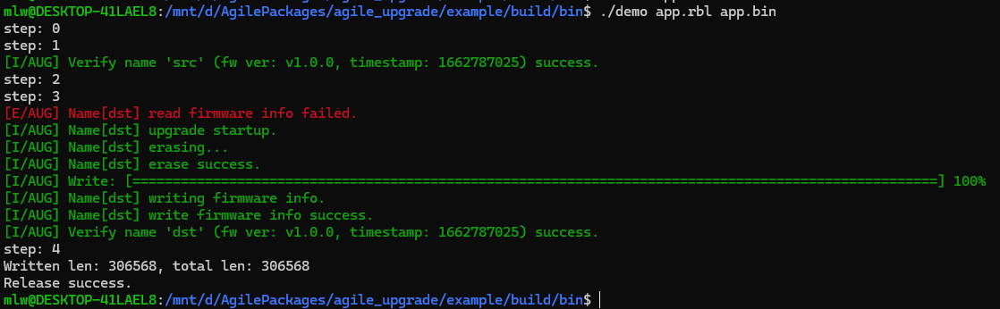

# 示例说明

## 1、介绍

该示例提供使用 `RT-Thread` 固件打包工具生成固件的解析演示。

`WSL` 或 `Linux` 下使用 `cmake` 可直接编译，在电脑上运行测试程序。

目录结构：

| 名称 | 说明 |
| ---- | ---- |
| fastlz-1.0.1 | fastlz 库源码 |
| quicklz-1.0.1 | quicklz 库源码 |
| tinycrypt-1.1.0 | tinycrypt 库源码 |
| figures | 素材 |
| inc | 头文件 |
| src | 源代码 |

## 2、使用

1. 命令行敲击 `cmake -B build` 、 `cmake --build build`

2. 使用固件打包工具生成固件。固件打包工具在 Agile Upgrade 的 `tools` 路径下

3. 执行命令 `./demo app.rbl app.bin`，解析完的固件存放在当前路径下的 `app.bin` 中

    
